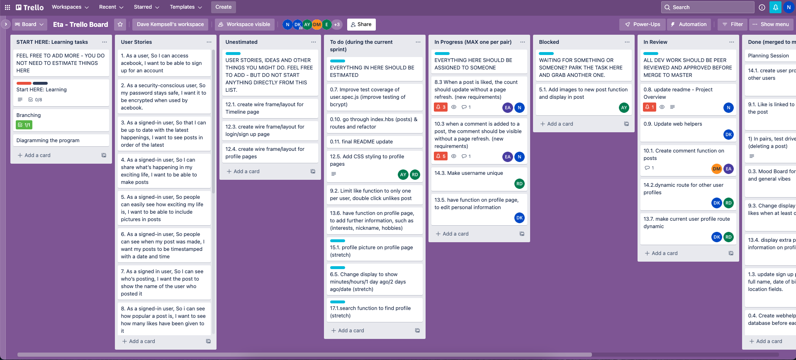

# Acebook - ETA Team build

## Overview

Acebook is a Facebook-clone developed whilst on the Makers Academy Bootcamp July 2022.

- A (full stack) web app that allows users to login to the social media platform
- Users can interact with other users and profiles by the feed through posts, comments and likes
- Build using Test Driven Development and working cohesively as a team

## Group Collabrators (Alphabetical)

- [Aisha](https://github.com/Aisha-Yusuff)
- [Daniel](https://github.com/danielotf)
- [Dave](https://github.com/davekempsell)
- [Ephron](https://github.com/Ephfullstack)
- [Raphaella](https://github.com/raphaella-rose)
- [Naz H](https://github.com/nazhudha)

## Features include:

- User can sign up
- User can log in
- User can log out
- User can create and edit posts (from own profile news feed)
- User can edit their post
- User can add and edit comments
- User can 'like' post and see 'likes' count
- User can view their own and other users profile page
- User's username and timestamp displayed next to their post

## Technologies:

- [Express](https://expressjs.com/) web framework for Node.js.
- [Nodemon](https://nodemon.io/) to reload the server automatically.
- [Handlebars](https://handlebarsjs.com/) to render view templates.
- [Mongoose](https://mongoosejs.com) to model objects in MongoDB.
- [ESLint](https://eslint.org) for linting.
- [Jest](https://jestjs.io/) for testing.
- [Cypress](https://www.cypress.io/) for end-to-end testing.

## Card wall (Trello Planning)



(https://trello.com/b/fBi79KiE/eta-trello-board)

## ScreenShots (app)

# Setup

## Quickstart

### Install Node.js

1. Install Node Version Manager (NVM)
   ```
   brew install nvm
   ```
   Then follow the instructions to update your `~/.bash_profile`.
2. Open a new terminal
3. Install the latest version of [Node.js](https://nodejs.org/en/), currently `18.1.0`.
   ```
   nvm install 18
   ```

### Set up your project

1. Fork this repository
2. Rename your fork to `acebook-<team name>`
3. Clone your fork to your local machine
4. Install Node.js dependencies
   ```
   npm install
   ```
5. Install an ESLint plugin for your editor. For example: [linter-eslint](https://github.com/AtomLinter/linter-eslint) for Atom.
6. Install MongoDB
   ```
   brew tap mongodb/brew
   brew install mongodb-community@5.0
   ```
   _Note:_ If you see a message that says `If you need to have mongodb-community@5.0 first in your PATH, run:`, follow the instruction. Restart your terminal after this.
7. Start MongoDB
   ```
   brew services start mongodb-community@5.0
   ```

### Start

1. Start the server
   ```
   npm start
   ```
2. Browse to [http://localhost:3000](http://localhost:3000)

#### Start test server

The server must be running locally with test configuration for the
integration tests to pass.

```
npm run start:test
```

This starts the server on port `3030` and uses the `acebook_test` MongoDB database,
so that integration tests do not interact with the development server.

### Test

- Run all tests
  ```
  npm test
  ```
- Run a check
  ```bash
  npm run lint              # linter only
  npm run test:unit         # unit tests only
  npm run test:integration  # integration tests only
  ```

## MongoDB Connection Errors?

Some people occasionally experience MongoDB connection errors when running the tests or trying to use the application. Here are some tips that may resolve such issues:

- Check that MongoDB is installed using `mongo --version`
- Check that it's running using `brew services list`

If you have issues that are not resolved by these tips, please reach out to a coach and, once the issue is resolved, we can add a new tip!
