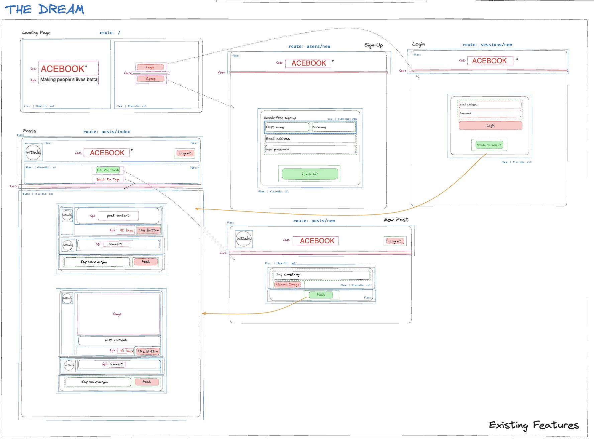
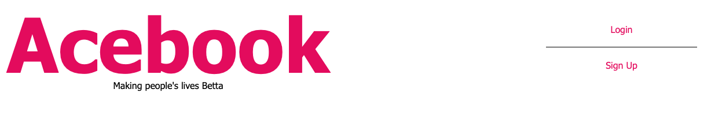
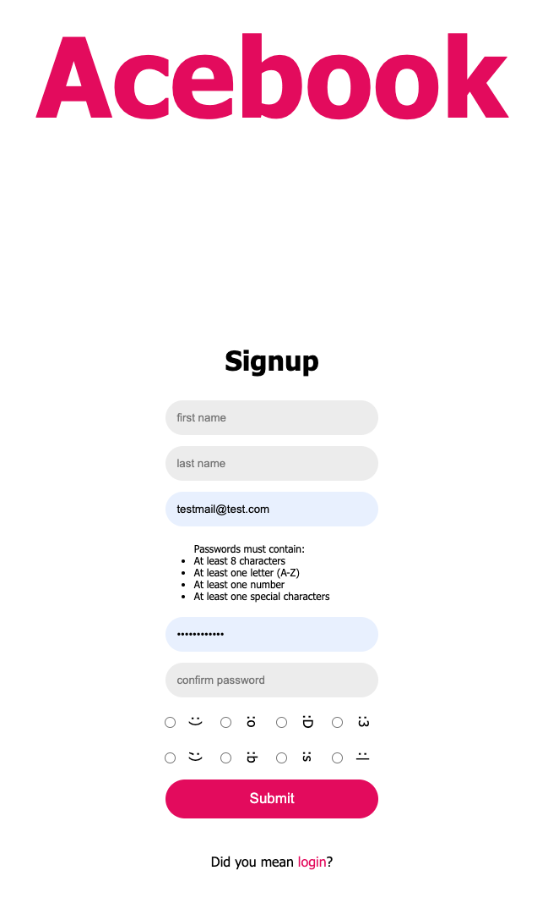
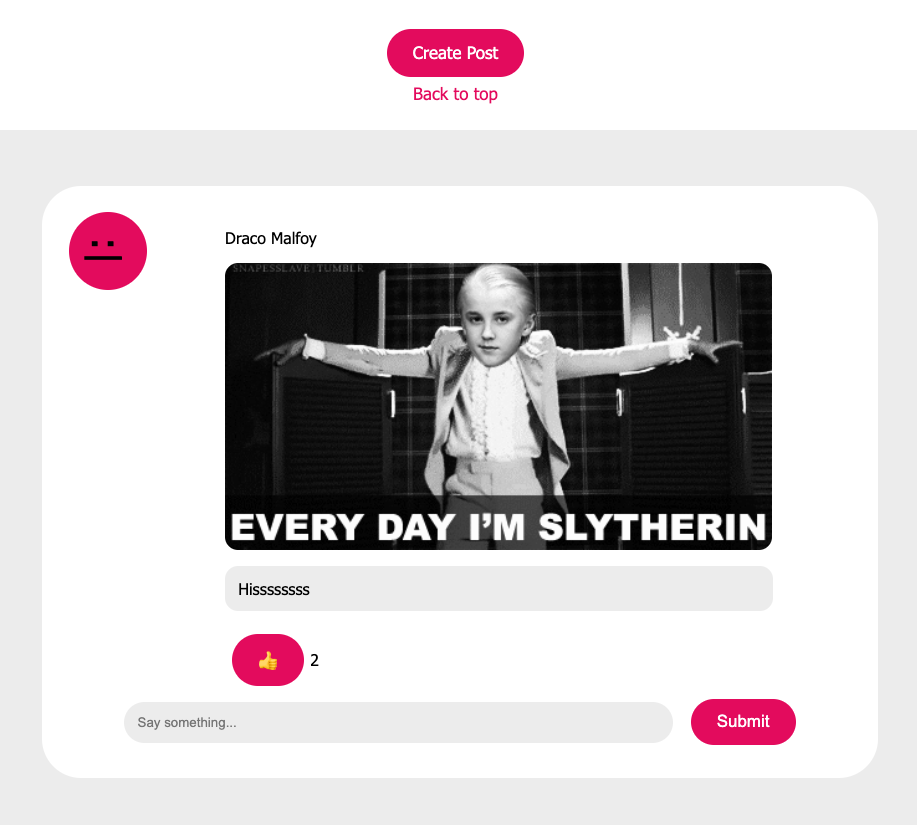
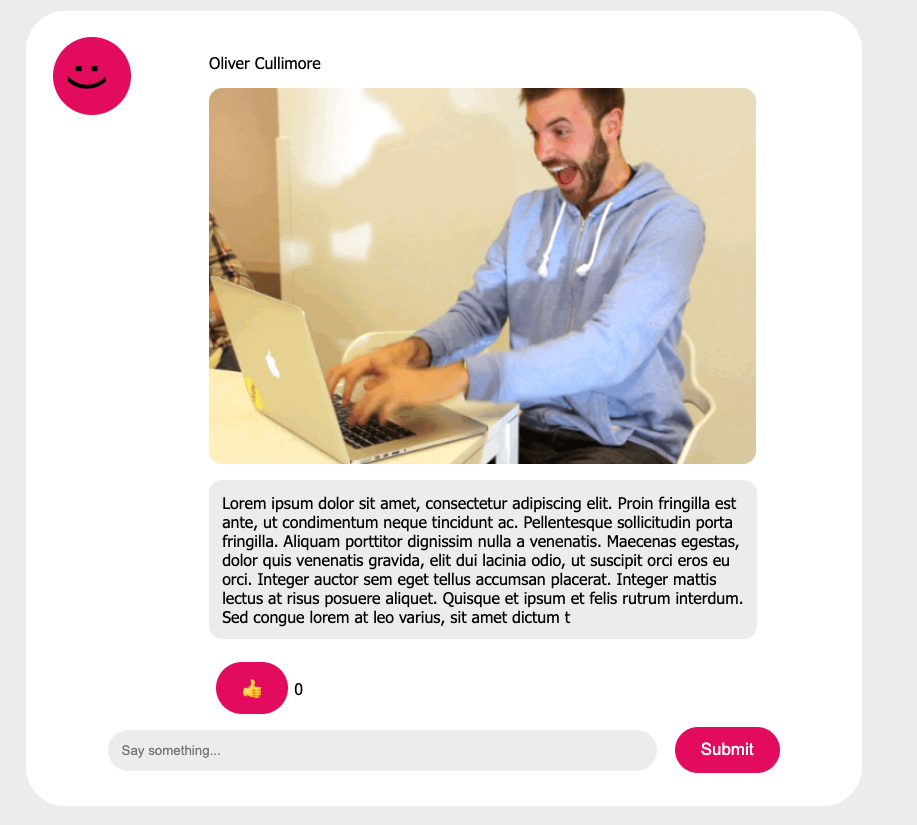
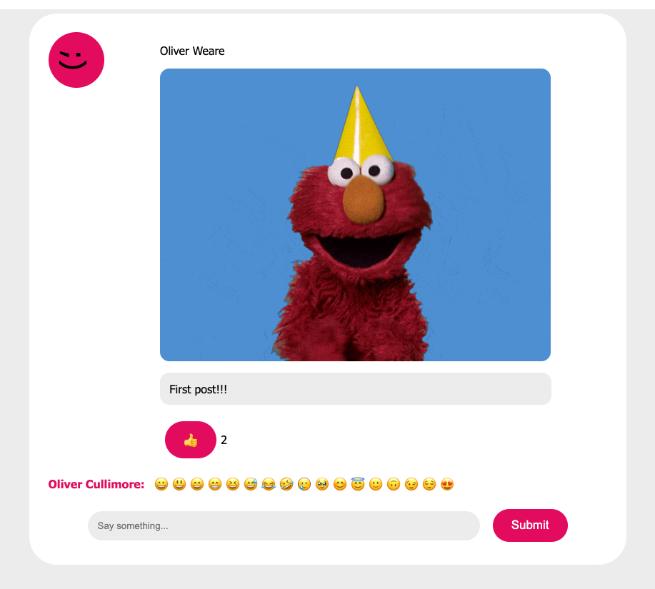
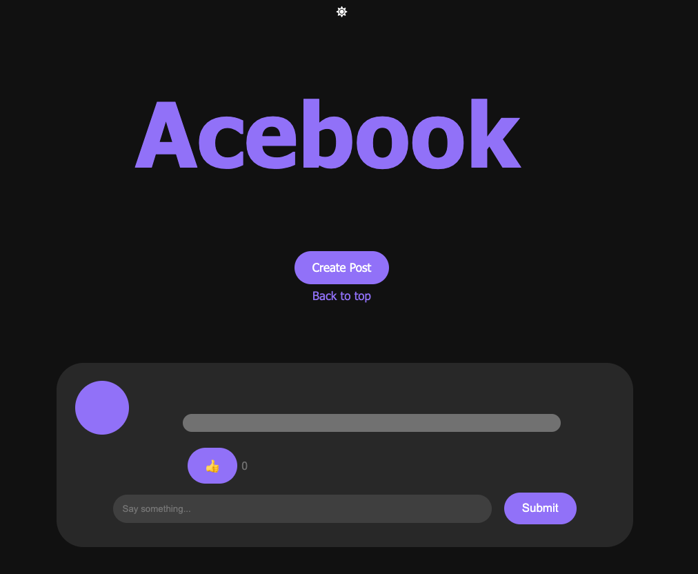
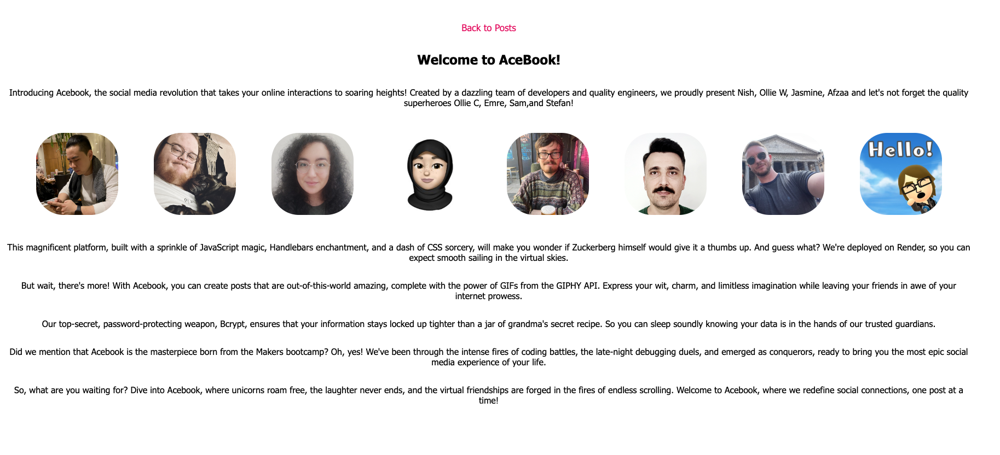

# **Acebook Betta - Final Engineering Project**
Acebook aims to be an easy-to-use and accessible platform that simplifies staying in touch with friends.  
Acebook will connect people and make their lives betta.

## **Motivation and Purpose**
  
  An opportunity to work alongside a team to build an engineering project as part of the bootcamp and get close to real-life exposure to agile working practice.  
  Also an opportunity to use all of the skills that we learned so far in bootcamp.

## **Outcome** 

  Over the 2 weeks of development we not only built a project and repository,  
  but used and learnt about a very large variety of tools and working practices, including standups, agile,  
  teamwork, sprints, retro's and conflict resolution, version-control, bug reporting, CI pipelines,  
  Trello boards, planning and execution, Unit and Integration testing, end-to-end testing, hosting,  
  working with an existing codebase, new languages, picking up new tools quickly, dividing up labor and tasks,  
  time management, strong communication practices, including messaging through slack and frequent meetings,  
  and most importantly working with a multi-discplinary team.
  
  In terms of the final product, we built and hosted live an MVP of the project as initially concieved in early planning stages,  
  as well as a variety of planning documents and test reports.  
  Our final version of the project encompassed all functionality that we initially aimed to have developed by the end of the timeframe,  
  although we had a large amount of 'Nice to Have' functions that were in the timeline. 

  
  The project is hosted live at [acebook.cool](https://www.acebook.cool/)). The version hosted is from a forked repo due to potential code conflicts - link below.

## **Tools used in this Project** 

- [Express](https://expressjs.com/) web framework for Node.js.
- [Nodemon](https://nodemon.io/) to reload the server automatically.
- [Handlebars](https://handlebarsjs.com/) to render view templates.
- [Mongoose](https://mongoosejs.com) to model objects in MongoDB.
- [ESLint](https://eslint.org) for linting.
- [Jest](https://jestjs.io/) for testing.
- [Cypress](https://www.cypress.io/) for end-to-end and integration testing.
- [Cypress Cloud](https://www.cypress.io/) for tracking testing, reporting and bug tracing.
- [Selenium](https://www.selenium.dev/documentation/webdriver/) for end-to-end testing.
- [Render](https://render.com/) for live hosting and CD Pipeline.
- [GitHub Actions](https://github.com/) for CI Pipeline and testing.
- [Trello Board](https://trello.com/) for tracking agile processes.
- [MongoDB Atlas](https://www.mongodb.com/cloud/atlas/register) for database hosting.
- [VSCode](https://code.visualstudio.com/) for development and shared coding.

## **Useful Links**

- [Repo for deployed project version](https://github.com/olic32/acebook-betta-render)
- [Installation Guide](INSTALLATION.md)
- [User Stories](betta_user_stories.md)
- [Test Scenarios and Automation Report](betta_test_scenarios.md)
- [Security Report](betta_security_report.md)
- [Accessibility Report](https://docs.google.com/document/d/1rBMSxzNgXs747tmHVDKBoszWmDwIkhp8ByLqVxFgwzo)
- [Online Site!](https://acebook.cool)
- [Locally Running Live Server](http://localhost:3000/)
- [Locally Running Test Server](http://localhost:3030/)
- [Trello Board](https://trello.com/b/ZcUWX9qo/betta-acebook)
- [CI/CD Process Breakdown](cypress/CICD_Info.md)

## **Guides and Outlines** 

### Wireframe

  

## **List of Completed Functionality**

- Signup, Login, Logout - All accounts stored on either a hosted or local MongoDB

    

- Associated name and personal 'Emoji Avatar' for each account

    

- Make posts comprised of text and optional Gifs, which are displayed to all users

    

- Like and comment on posts, which are also displayed publicly

    

- Emoji support on comments and posts

    

- Light mode and Dark mode

    

- About/Credits page

    

## **Credits**

### Development Team:
- [Afzaa Atcha](https://github.com/afzaa25)
- [Jasmine Harper](https://github.com/jasmine-asra)
- [Nishad Rai](https://github.com/nrai14)
- [Oliver Weare](https://github.com/gwaarb)

### QA Team:
- [Emre Nallar](https://github.com/devCoder69409)
- [Oliver Cullimore](https://github.com/olic32)
- [Sam George](https://github.com/samgeorge21)
- [Stefan Spencer](https://github.com/S-Spencer)
