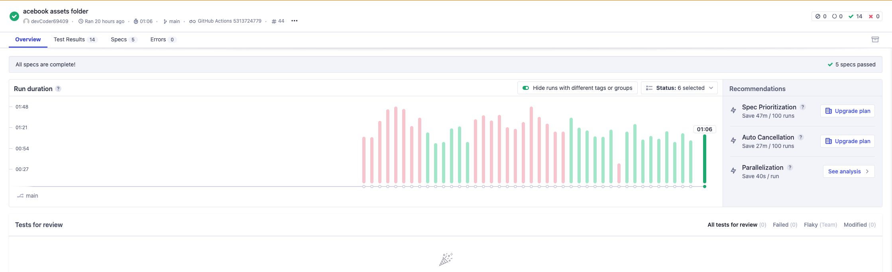

# CI/CD Pipeline Information

This project utilises Cypress, Github Actions, Cypress Cloud, Render and MongoDB Atlas for CI/CD and deployment.

- Cypress is used to run the integration tests, including some end-to-end testing.

- Github Actions runs these tests on every successful pull request.

- Cypress Cloud stores the test data and allows for tracking and analytics in our bug reporting.

- Render hosts and deploys the NodeJS Project.

- MongoDB Atlas hosts the live database for the production deployment.

## Pipeline steps:

1. A pull request is made and successfully merged with main branch.
2. Github Actions triggers and installs Node.js.
3. Github Actions installs a MongoDB, installs the project dependencies and makes a build.
4. Unit tests are run using Jest.
5. The test server starts and Cypress begins its test run.
6. The Cypress test begins by attempting a signup and creating an admin profile, which is then used for later tests.
7. At the end of the tests, the test database is dropped.
8. The test run completes and test data is stored in Cypress Cloud for analysis.
9. Render acknowledges the new commit and rebuilds the deployment, connecting to the live database on MongoDB Atlas. 

## Test Scope

### Unit: ###
- 20 Tests covering all base classes

### Integration and End-To-End: ###
- 6 Selenium tests, running on Firefox and Chrome, covering most functionality
- 14 Cypress tests, running on Chrome and Edge, covering most functionality

## Other notes and screenshots

Cypress Cloud

